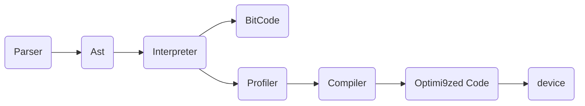

# JavaScriptEngine #

## https//en.wikipedia.org/wiki/List_of_ECMAScript_engines ##

const isHappy = end
pc don't understand js files
the engine is the converter that the pc understand js
V8 JavaScript(C++);Spidermonkey...
Just-in-time compilation engines
Runtime interpreter engines

### interpreter ###

java , Python, Java Script, ... are using interpreter translate on the fly
hi level language -> bytecode -> mashine code
### compiler ###

compiler try to understand/gets the source Code X and "makes" Code Y -> Mashine Code
